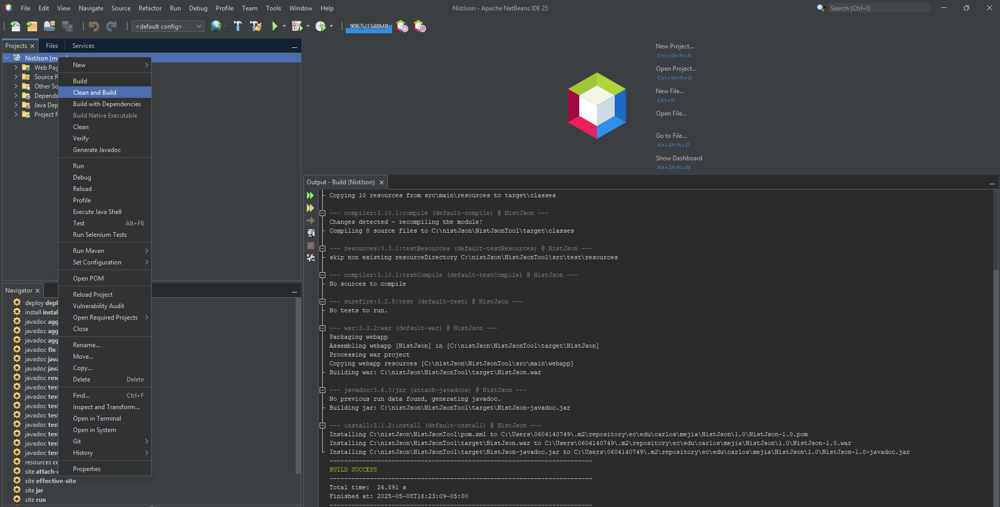
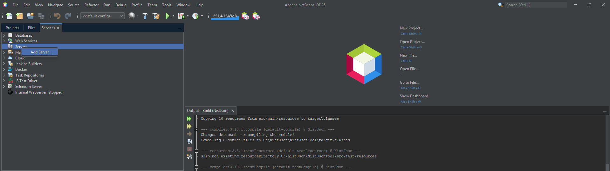

# NistJson: Open-Source Tool for JSON Processing and Software Vulnerabilities Analysis Based on NIST NVD

## Description
NistJson is a web-based Java application meticulously designed for the efficient processing, analysis, and export of Common Vulnerabilities and Exposures (CVE) data released by the National Vulnerability Database (NVD). Unlike command-line utilities or scripts, NistJson incorporates an interactive, multilingual graphical user interface (GUI), designed with Jakarta EE and PrimeFaces, providing an accessible and reproducible environment for software vulnerability analysis.

The application allows users to filter CVEs by year and keyword, correlate them with Common Weakness Enumeration (CWE) categories, and export the resulting datasets in Comma-Separated Values ​​(CSV) format. Due to its keyword filtering capabilities, it can be applied to any branch of knowledge, including eHealth security, DevSecOps processes, and academic research that requires comprehensive vulnerability assessments and reproducibility.

## Key Features

- **Intuitive Web Interface with Flexible Configuration**: Tailored for both proficient developers and individuals lacking technical expertise, NistJson features a contemporary web interface constructed utilizing JSF and PrimeFaces. Users possess the capability to directly modify parameters such as temporal ranges, keywords, and output language through the interface.

- **Internationalization and Multilingual UI**: Incorporates inherent support for English, Spanish, French, Portuguese, and German. Users have the ability to transition between languages during runtime via a session-aware user interface component, with language files administered through JSF resource bundles.

- **Multi-file JSON Upload & High-Performance Parsing**: Facilitates the batch upload of JSON files (in SCAP format) sourced from the National Vulnerability Database (NVD), thus enabling scalable and efficient parsing of extensive datasets through the utilization of the Jackson library.

- **Advanced Filtering and Data Enrichment**: Offers comprehensive parameterizable filtering predicated on keywords, year ranges, and additional criteria. Enhances vulnerability entries with enriched metadata, including CVSS metrics, CWE classifications, and relevance concerning health.

- **Vulnerability Classification and Metrics**: Categorizes CVEs into CWE classifications and computes sophisticated statistics encompassing average scores, software presence, and health impact metrics pertinent to each category.

- **Export to CSV and ZIP**: Produces downloadable CSV files encompassing CVE entries, CWE summaries, and affected software products. All outputs are systematically consolidated into a ZIP archive for the sake of user convenience during download.

- **Research Reproducibility and Output Integrity**: Guarantees consistency in data processing by standardizing input formats and execution parameters, thereby facilitating reproducibility in both academic and professional research endeavors.

- **Modular and Extensible Architecture**: Engineered with rigorous object-oriented principles and a modular framework, permitting the seamless integration of new filters, views, or export formats with minimal disruption to the existing codebase.

- **Cross-platform and Standards-based Deployment**: Constructed utilizing Java 17 and Jakarta EE 10, the application is encapsulated as a WAR file and is deployable on any compliant application server (e.g., Payara, WildFly) across various operating systems including Windows, Linux, or macOS.

## Installation of NetBeans Ide 8.0.2

1. Run the Apache NetBeans Ide 25 installer and press the "Next" button:
   

  

2. Accept the Licence Agreement and click on “Next” button:

  

 3. Select the installation path and click on Next button 
    

  

  
 4. Click on install button 
    

  

 
 5. Wait until the installation process is completed
    

  

 
 6. Click on the Finish button 
    

  

## Preparing java project

 1. Select the directory to which the repository will be cloned:  
    

  

    
 2. Run the command git clone https://github.com/cmejia5486/NistJsonTool.git
    

  

 

 3. Visit the NIST NVD URL https://nvd.nist.gov/vuln/data-feeds, download the data feeds in JSON format, and place them in an accessible directory for later upload to the web application. 
    

  

 

 4. Open the project in the previously installed Apache NetBeans Ide 25 and click on clean and build option.
    

  

 

 5. Go to the services tab, in the servers option select "Add Server...".
    

  

 

 6. Select "Payara Server" and click next.
    

  

 

7. Select option 6.2025.4 and click the "Download Now..." button.
    

  

 

8. Once the necessary files have been downloaded, click the "Next" button.
    

  

 

9. Review the settings for the Payara server and click the "Finish" button.
    

  

 

10. Right click on Payara Server and press the "Start" button..
    

  

 

## Setting the keywords

 1. Inside the nist.main package go to the main.class class and in the list of strings you can add as many "keys" as you consider necessary, for the particular example "HEALTH" and "MEDIC" have been added.
    

  

 

## 6.	Running the tool

 1. Right click on the project and press the "Run" button, this will process the files in JSON format and generate the processed data as output in CVS format.
    

  

 

 2. At the end of the execution of the tool, an output like the one presented will be generated. 

  

 

 3. The generated files will be found under the directory:  ../nistJson/results. 

  

 

 4. Right click over the VulnerabilityDataExporter java class and select “RunFile option

  

 

 5. Once the execution is finished without exceptions, it will issue the information message about the files with the generated metrics

  

 

 6. The generated files will be found under the directory:  ../nistJson/spss

## Demo
[Demo video](https://youtu.be/LmwGtRXYmxI?si=MOAlIm66rHSoARXy)

## Technical Documentation Manual
[JavaDoc](target/reports/apidocs/index.html)

## **License:**
This project is licensed under the GNU General Public License Version 3 - see the [LICENSE](https://github.com/cmejia5486/nistJson/blob/main/LICENSE) file for details. 

## **Contact:**
**Carlos M. Mejía-Granda** 

- E-mail: <carlosmichael.mejiag@um.es>
- LinkedIn: [Carlos Mejía Granda](https://www.linkedin.com/in/carlos-mej%C3%ADa-granda-70239910a/).

## **Acknowledgements**

We would like to express our gratitude to the National Institute of Standards and Technology (NIST) National Vulnerability Database (NVD) for providing their data feeds in JSON format, which have been invaluable in our experiments and are included as data samples in this repository.
